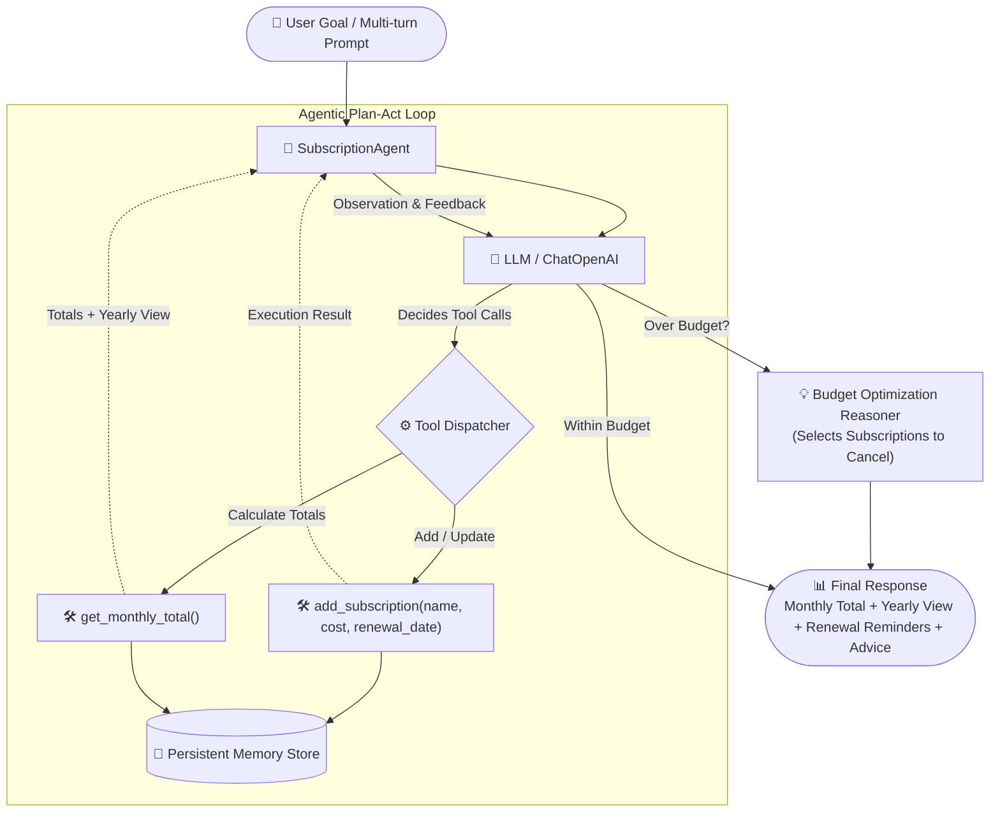

# T4. Subscription Manager Agent

This agent uses two core Python tools to track and manage finances: `add_subscription(name, cost)` to save active subscriptions along with their renewal dates, and `get_monthly_total()` to inspect active subscriptions, calculate the monthly total, and generate a yearly-cost view alongside renewal-date reminders (Group of 3 add-on).

The memory component maintains state across multiple conversational turns by storing all active subscriptions in a persistent dictionary. Rather than operating as a stateless chatbot, the agent remembers previously registered services and user budget limits, allowing it to autonomously detect budget overages and recommend optimal subscriptions to cancel to restore budget balance.

An honest failure encountered during development was that the model initially attempted to calculate the monthly and yearly spending in its head before tools executed, occasionally hallucinating sums on multi-turn additions. We resolved this by strictly enforcing a multi-step Plan-Act loop where the agent must first execute `add_subscription` and then call `get_monthly_total` to observe verified totals from memory before making cancellation recommendations.

---

## 🏗️ System Architecture

### Architectural Components

1. **Agent Controller (`agent.py`)**: Implements the LangChain-powered plan-act loop. It binds tools, manages message history across multi-turn interactions, executes tool invocations, and handles observation feedback.
2. **Tools Layer (`tools.py`)**:
   - `add_subscription(name, cost, renewal_date)`: Sanitizes input costs and registers services into memory.
   - `get_monthly_total()`: Reads active state, computes monthly total, and calculates the 12-month annualized projection.
3. **Memory Store**: In-memory persistent dictionary retaining subscription records and renewal dates across conversational turns.
4. **Agentic Reasoner**: When spending exceeds the user-defined budget limit, the agent reasons over active subscriptions and formulates strategic cancellation suggestions to restore budget balance.
