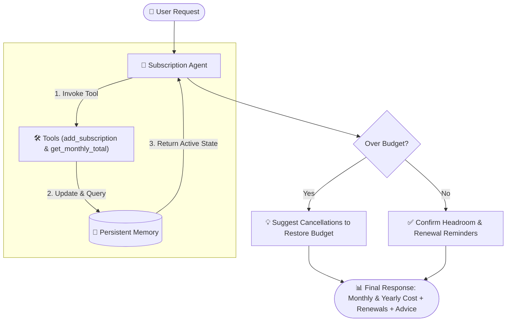

# T4. Subscription Manager Agent

This agent uses two core Python tools to track and manage finances: `add_subscription(name, cost)` to save active subscriptions along with their renewal dates, and `get_monthly_total()` to inspect active subscriptions, calculate the monthly total, and generate a yearly-cost view alongside renewal-date reminders (Group of 3 add-on).

The memory component maintains state across multiple conversational turns by storing all active subscriptions in a persistent dictionary. Rather than operating as a stateless chatbot, the agent remembers previously registered services and user budget limits, allowing it to autonomously detect budget overages and recommend optimal subscriptions to cancel to restore budget balance.

An honest failure encountered during development was that the model initially attempted to calculate the monthly and yearly spending in its head before tools executed, occasionally hallucinating sums on multi-turn additions. We resolved this by strictly enforcing a multi-step Plan-Act loop where the agent must first execute `add_subscription` and then call `get_monthly_total` to observe verified totals from memory before making cancellation recommendations.

---

## 🏗️ Architecture & Flow

### ⚡ Flash Summary:
1. **User Request** $\rightarrow$ User adds subscriptions or sets a budget.
2. **Plan-Act Loop** $\rightarrow$ Agent executes `add_subscription` & calls `get_monthly_total`.
3. **Memory Store** $\rightarrow$ Remembers all active subscriptions across multi-turn sessions.
4. **Agentic Decision** $\rightarrow$ If spending exceeds budget, it calculates and recommends optimal cancellations.
5. **Output** $\rightarrow$ Delivers monthly total, yearly cost projection, renewal-date reminders, and action plan.
